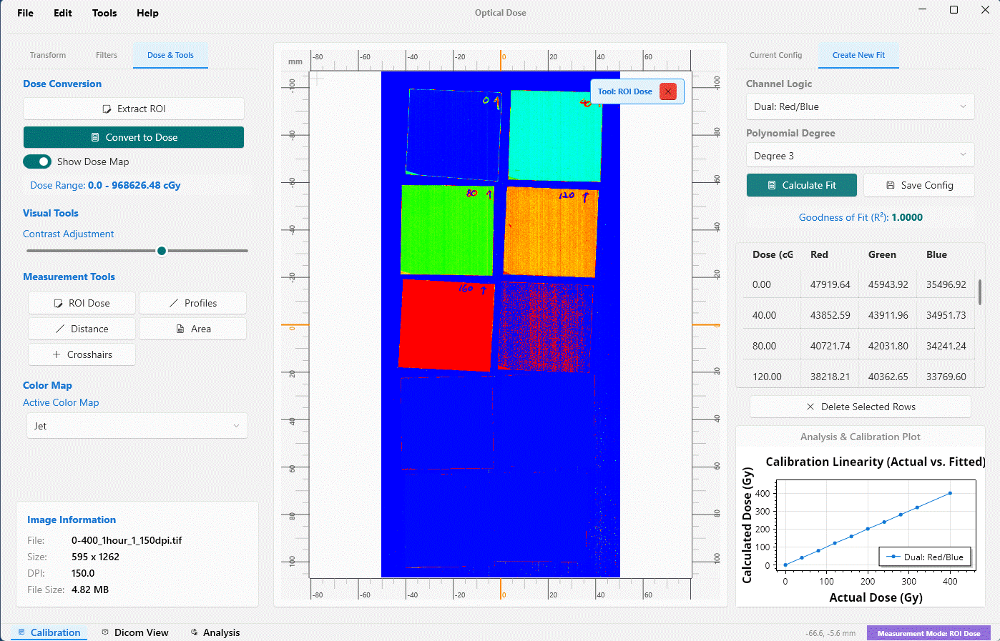
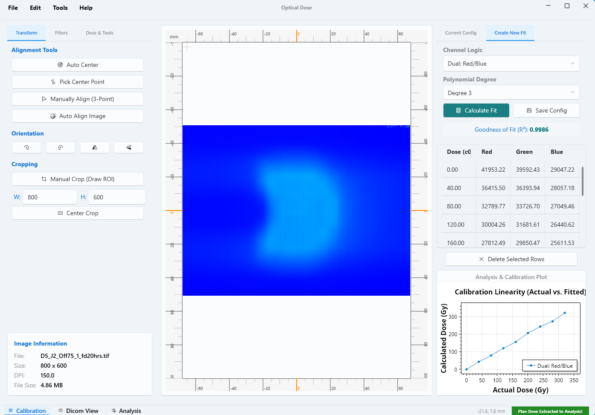
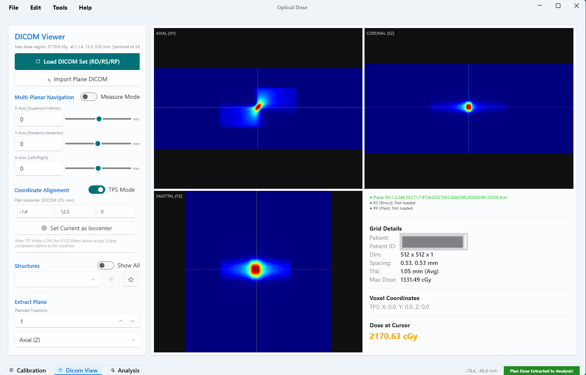
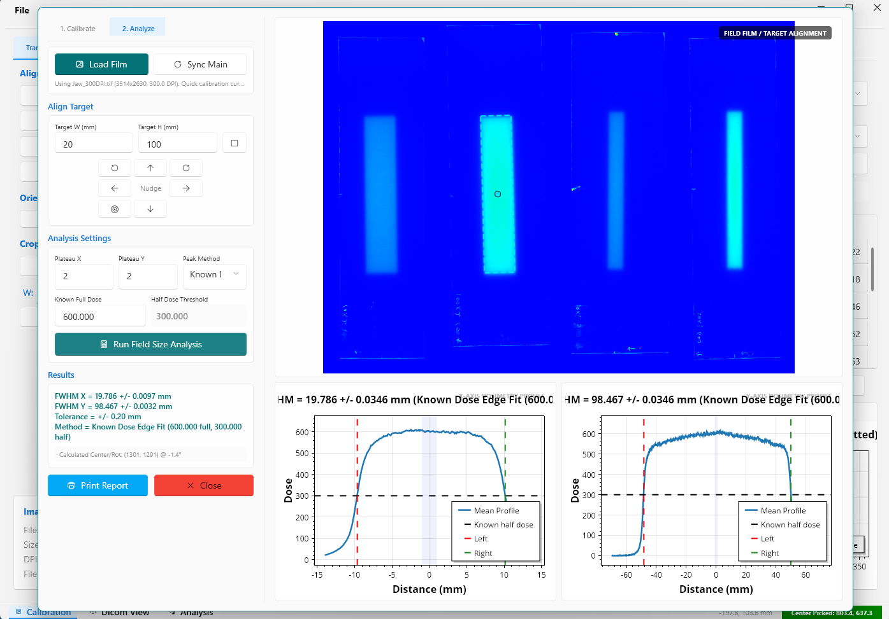
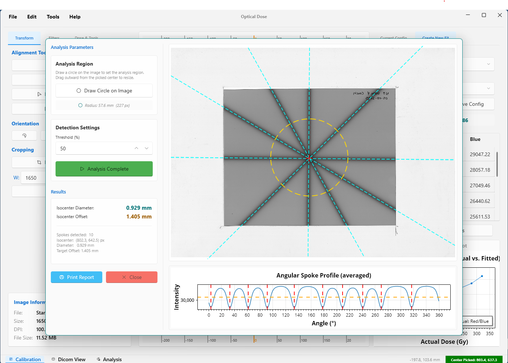

# Optical Dose

[](https://dotnet.microsoft.com/)
[](https://learn.microsoft.com/dotnet/desktop/wpf/)
[](LICENSE)

Optical Dose is a Windows desktop application for radiochromic film dosimetry, DICOM RT dose review, and planar dose comparison. It brings film calibration, TIFF film processing, RTDOSE/RTSTRUCT/RTPLAN visualization, gamma analysis, field-size checks, and star-shot QA into one polished WPF workflow.

It is built for researchers, physicists, developers, and QA teams who want a transparent, inspectable toolchain for optical film dose analysis.

<p align="center">
  
</p>

> Clinical safety note: Optical Dose is research and QA software. It must be independently commissioned, validated, and reviewed before any clinical use. Always verify calibration, scanner behavior, dose scaling, DICOM orientation, gamma settings, and report outputs against your local procedures and reference datasets.

## Why Optical Dose?

Film dosimetry work often jumps between separate image tools, spreadsheets, DICOM viewers, scripts, and reporting templates. Optical Dose pulls the practical pieces into one desktop app:

- Film scan processing and dose conversion.
- DICOM RT dose review and plane extraction.
- Measured-vs-planned dose comparison.
- Gamma analysis with profiles and ROI handling.
- Field-size and star-shot QA tools.
- Printable reports for QA documentation.

## Highlights

- Load standard images and 16-bit TIFF film scans.
- Build calibration models from measured RGB/optical-density points.
- Convert film scans to dose maps using single-channel, dual-channel, or triple-channel methods.
- Load DICOM RTDOSE, RTSTRUCT, and RTPLAN files.
- Review RT dose in axial, coronal, and sagittal multi-planar views.
- Render DICOM structure contours and inspect LPS/TPS-relative coordinates.
- Extract planned dose planes for comparison with measured film dose.
- Run film-vs-plan gamma analysis with ROI selection, shifts, scaling, thresholds, and profile plots.
- Measure distances, areas, ROI dose, crosshair coordinates, and image profiles.
- Perform FWHM field-size analysis.
- Perform star-shot isocenter QA and generate printable reports.

## Screenshot Tour

### Film Calibration And Image Processing

Load a film scan, inspect dose response, apply alignment/crop tools, build calibration fits, and convert optical response to dose.



### DICOM Plane Extraction

Navigate RTDOSE data in axial, coronal, and sagittal views, inspect dose and coordinates, then extract a comparison plane.



### Gamma Analysis

Compare measured film dose against planned DICOM dose with spatial shifts, gamma criteria, profile sampling, and pass-rate visualization.


### QA Tools

Field-size and star-shot analysis tools are included for common film-based QA checks.

| Field Size | Star Shot |
| --- | --- |
|  |  |

## Core Workflows

Optical Dose is organized around three core workflows:

1. **Film processing:** load film scans, apply image transforms/filters, create or load calibration data, convert optical response into dose, and export measured dose maps.
2. **DICOM review:** load RT dose, structure, and plan files; navigate dose planes; inspect contours and coordinates; extract a planned plane for analysis.
3. **Plan comparison and QA:** synchronize measured and planned dose, align the datasets, select analysis regions, run gamma analysis, and generate reports.

Additional QA tools include field-size analysis and star-shot analysis windows.

## Technology Stack

- **Language:** C#
- **UI:** WPF
- **Runtime:** .NET 8 for Windows
- **Project type:** `WinExe`
- **DICOM:** `fo-dicom`
- **TIFF:** `BitMiracle.LibTiff.NET`
- **Plotting:** `ScottPlot.WPF`
- **UI controls/theme:** `WPF-UI`

NuGet dependencies are declared in [OpticalDose.csproj](OpticalDose.csproj).

## Requirements

- Windows
- .NET 8 SDK
- Visual Studio 2022 or newer with the .NET desktop development workload, or the `dotnet` CLI

Because the project targets `net8.0-windows` and uses WPF, Optical Dose is Windows-only.

## Getting Started

Clone the repository:

```powershell
git clone https://github.com/<your-user-or-org>/OpticalDose.git
cd OpticalDose
```

Restore and build:

```powershell
dotnet restore
dotnet build
```

Run the app:

```powershell
dotnet run --project OpticalDose.csproj
```

You can also open [OpticalDose.sln](OpticalDose.sln) in Visual Studio and run the `OpticalDose` project directly.

## Repository Layout

```text
.
|-- OpticalDose.sln
|-- OpticalDose.csproj
|-- App.xaml / App.xaml.cs
|-- MainWindow.xaml / MainWindow.xaml.cs
|-- AnalysisControl.xaml / AnalysisControl.xaml.cs
|-- DicomControl.xaml / DicomControl.xaml.cs
|-- FieldSizeWindow.xaml / FieldSizeWindow.xaml.cs
|-- StarShotWindow.xaml / StarShotWindow.xaml.cs
|-- CalibrationConfig.cs
|-- DoseCalculator.cs
|-- FittingMath.cs
|-- ImageFilters.cs
|-- ImageTransforms.cs
|-- ColorMaps.cs
|-- Models.cs
|-- StructureSet.cs
|-- Icon.png
|-- SamplePlane.dcm
|-- screen/
    |-- main.gif
    |-- MainApp.png
    |-- DicomPlaneExtraction.png
    |-- Gamma Analysis.png
    |-- FieldSize.png
    |-- StarShot.png
```

Generated build output lives under `bin/` and `obj/`. These folders can be recreated by building the project and should not be treated as source.

## Film Calibration

Calibration data is represented by `CalibrationConfig` and can be saved as text configuration files in the configured calibration folder. If a custom calibration path is not set, the app creates a `Calibrations` folder beside the built executable.

Supported calibration modes include:

- `Single: Red`
- `Single: Green`
- `Single: Blue`
- `Dual: Red/Blue`
- `Dual: Green/Blue`
- `Triple: Red|Green|Blue`

Calibration points contain known dose values and measured red, green, and blue channel values. Polynomial fits are calculated in [FittingMath.cs](FittingMath.cs), and dose conversion is handled in [DoseCalculator.cs](DoseCalculator.cs).

The current dose-conversion approach:

- Converts channel values to optical density with `-log10(channel / 65535)`.
- Evaluates a fitted polynomial for single-channel modes.
- Uses OD ratios for dual-channel modes.
- Averages red, green, and blue dose estimates for triple-channel mode.

## Film Image Tools

The main film workspace supports:

- Loading display images and 16-bit TIFF film scans.
- Reading red, green, and blue channel data.
- Applying TIFF orientation metadata.
- Rotating and flipping images.
- Manual and fixed-size cropping.
- Median, average/box, Gaussian, noise, and ROI filters.
- Nearest, linear, and cubic interpolation.
- Undo/redo for image-processing operations.
- ROI extraction and measurement.
- Dose-map export/import as text files.
- Dose heatmaps with gray, jet, hot, and viridis color maps.

Key source files:

- [MainWindow.xaml.cs](MainWindow.xaml.cs)
- [ImageFilters.cs](ImageFilters.cs)
- [ImageTransforms.cs](ImageTransforms.cs)
- [ColorMaps.cs](ColorMaps.cs)
- [Models.cs](Models.cs)

## DICOM RT Workflow

The DICOM viewer uses `fo-dicom` and supports:

- `RTDOSE` dose grids.
- `RTSTRUCT` structure contours.
- `RTPLAN` isocenter and fraction metadata.

Capabilities include:

- Multi-file loading of dose, structure, and plan files.
- Axial, coronal, and sagittal multi-planar reconstruction.
- LPS coordinate display.
- TPS-relative coordinate mode using a loaded or manually set isocenter.
- Cursor dose readout in cGy.
- Structure contour rendering.
- Navigation to selected structure centers.
- Navigation to maximum-dose locations.
- Measurement tools in MPR views.
- Extraction of axial, coronal, or sagittal dose planes.
- Import of pre-extracted single-frame DICOM planes.
- Export of extracted dose planes as text maps.

DICOM dose values are scaled with `DoseGridScaling` and converted to cGy. When RTPLAN fraction information is available, the app uses it during extraction/export; otherwise, it prompts for the number of fractions.

## Gamma Analysis

The Analysis tab compares measured film dose against planned DICOM dose.

Features include:

- Synchronizing measured film dose from the film workspace.
- Synchronizing planned dose from the DICOM viewer.
- Displaying measured, planned, and gamma heatmaps.
- Applying X/Y spatial shifts in millimeters.
- Applying measured-dose scaling.
- Choosing dose-difference and distance-to-agreement criteria.
- Selecting global or local normalization.
- Applying low-dose thresholding.
- Using bilinear or bicubic interpolation for planned-dose sampling.
- Selecting and cropping a shared ROI.
- Picking profile points and viewing X/Y dose profiles.
- Creating report snapshots for printing.

Advanced gamma settings are stored in `AppSettings`:

- `GammaUncertainty`
- `GammaSearchStep`
- `GammaSmoothingSigma`
- `GammaUseBicubic`

## Field-Size Analysis

[FieldSizeWindow.xaml.cs](FieldSizeWindow.xaml.cs) provides FWHM field-size and alignment analysis.

Capabilities include:

- Nominal field width/height setup in millimeters.
- Drag-and-nudge reticle alignment.
- Small rotation adjustments.
- Plateau-region setup.
- Maximum, mean, or median peak selection.
- FWHM X/Y calculation from 50% edge crossings.
- X-axis and Y-axis profile plots.
- Print report generation.
- Quick 3-point calibration using 0 MU, 300 MU, and 600 MU regions.
- Loading separate calibration and analysis TIFF scans.

## Star-Shot Analysis

[StarShotWindow.xaml.cs](StarShotWindow.xaml.cs) provides star-shot QA analysis from a dose image.

Capabilities include:

- Drawing an analysis circle over the image.
- Setting detection threshold.
- Detecting beam/spoke crossings.
- Estimating radiation isocenter.
- Reporting isocenter diameter and offset in millimeters.
- Drawing detected spokes and isocenter overlays.
- Plotting analysis results with ScottPlot.
- Printing a star-shot report.

## Reports

The app uses WPF `FlowDocument` and print dialogs for reporting. Reports are available for:

- Film dose and gamma comparison.
- Field-size analysis.
- Star-shot analysis.

Reports include calculated metrics and captured visual elements such as maps, overlays, and profile plots.

## Data And Settings

The application writes runtime settings beside the built executable:

- `app_settings.json`

Older settings may also be read from:

- `roi_settings.json`

Calibration files are stored in the configured calibration folder. Dose maps exported from film or DICOM workflows are text files with metadata headers and dose values.

## Build Notes

Common developer commands:

```powershell
dotnet restore
dotnet build
dotnet run --project OpticalDose.csproj
dotnet clean
```

Release build:

```powershell
dotnet build -c Release
```

Publish framework-dependent build:

```powershell
dotnet publish OpticalDose.csproj -c Release -r win-x64 --self-contained false
```

Publish self-contained build:

```powershell
dotnet publish OpticalDose.csproj -c Release -r win-x64 --self-contained true
```

## Current Testing Status

No automated test project is currently included. Before relying on changes, manually verify at least:

- TIFF loading and orientation handling.
- Calibration fit creation and saved config reload.
- Dose conversion against known calibration points.
- DICOM RTDOSE loading and dose scaling.
- RTSTRUCT contour display on known slices.
- RTPLAN fraction/isocenter parsing.
- Plane extraction orientation and spacing.
- Gamma pass-rate calculation on a known film/plan pair.
- Field-size FWHM on a known field.
- Star-shot result on a known QA image.

## Known Implementation Notes

- Most UI and workflow logic currently lives in WPF code-behind files.
- `AutoAlign_Click` is present but not implemented yet.
- `SamplePlane.dcm` is included as a sample DICOM plane.
- The app assumes Windows desktop APIs and WPF printing support.

## Suggested Roadmap

- Add automated tests for calibration math, filtering, interpolation, gamma search, and DICOM plane orientation.
- Split larger code-behind files into services for dose math, DICOM extraction, reporting, and image processing.
- Add validation datasets with expected outputs.
- Add example calibration and dose-map files.
- Add CI build verification.
- Add repeatable packaging and publishing scripts.

## Contributing

Contributions are welcome. Good first areas include tests, documentation, validation datasets, small bug fixes, and refactoring isolated calculation logic out of UI code.

Before opening a pull request:

- Build the project with `dotnet build`.
- Manually test any affected workflow.
- Keep changes focused and explain the dosimetry or DICOM assumptions involved.
- Avoid committing generated `bin/` or `obj/` output.

## License

This project is licensed under the MIT License. See [LICENSE](LICENSE) for details.

## Disclaimer

This software is provided as-is, without warranty, and is not a substitute for clinical judgment, independent QA, local commissioning, or regulatory compliance. Users are responsible for validating the software for their own environment and use case.
